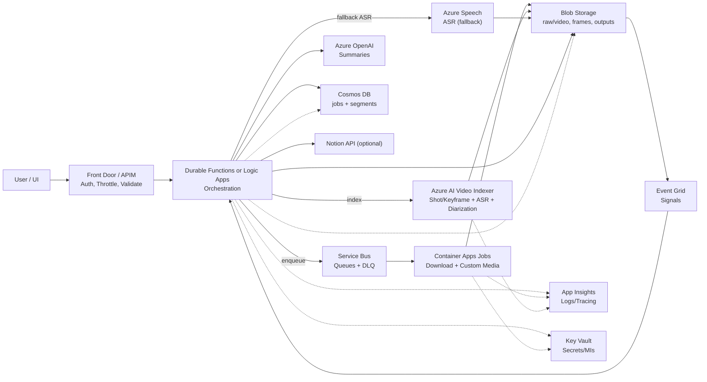
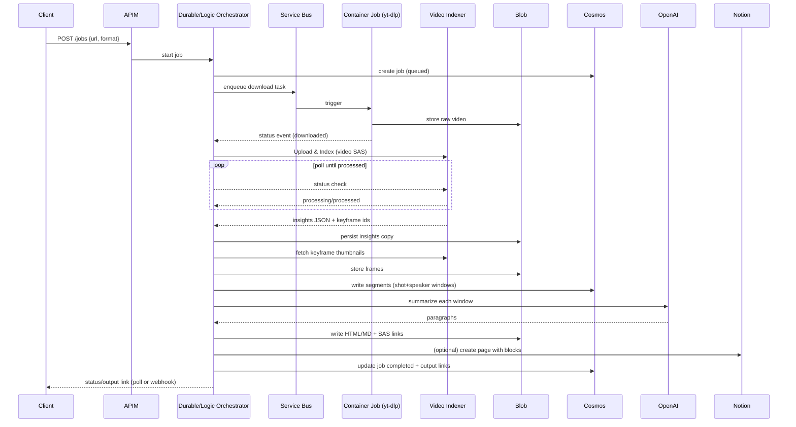

# Video-to-Notion Backend on Azure

High-level design for turning a YouTube URL into Notion-ready HTML/Markdown with real frames and aligned transcript. Incorporates Azure AI Video Indexer insights (shot/keyframe + speaker diarization) with a custom media fallback.

## Goals and Constraints
- **Frame-first evidence**: Always use actual frames, not AI renderings.
- **Alignment quality**: Segment on shot changes and speaker switches; keep transcript and images time-synced.
- **Serverless bias**: Prefer managed Azure AI/PaaS; keep heavy media in container jobs when needed.
- **Notion-ready**: Produce clean HTML/Markdown with image URLs (SAS) that Notion can import or that can be posted via Notion API.

## Core Services
- **Front Door / APIM**: Public ingress, auth, throttling, schema validation.
- **Azure Functions (Durable)**: Orchestration, status tracking, manifest assembly, Notion export.
- **Azure Logic Apps (optional)**: Low-code orchestration with Video Indexer/Blob connectors if code-first Durable isn't preferred.
- **Service Bus**: Decouples ingest from heavy processing; DLQ for failures.
- **Azure AI Video Indexer (primary media path)**: Shot/scene/keyframe detection, speaker diarization, and transcript with timestamps; thumbnail API for keyframes.
- **Azure Container Apps Jobs (fallback/custom media path)**: `yt-dlp`, `ffmpeg`, `PySceneDetect`, Speech SDK for BYO processing or when VI quotas/regions block use.
- **Azure Blob Storage**: Raw video, keyframes, index JSON, final outputs.
- **Cosmos DB (or Table)**: Job state and per-segment manifests.
- **Azure OpenAI**: Summarization of aligned transcript windows.
- **Azure Speech (custom path)**: ASR with timestamps/diarization when not using VI.
- **Event Grid**: Blob-created events to signal orchestrator; optional webhook fan-out.
- **Key Vault + Managed Identities**: Secrets (Notion/OpenAI/Speech/VI) and identity for Blob/Cosmos access.
- **App Insights / Log Analytics**: Tracing across Functions, Logic Apps, and container jobs.

## Data Flow (Video Indexer-first happy path)
1) **Submit**: Client posts YouTube URL -> APIM -> Durable/Logic orchestrator; validate and write `jobs` record (`queued`).
2) **Download**: Container App Job pulls the video via `yt-dlp` to Blob `raw/vid/{jobId}.mp4`; emit status via Event Grid.
3) **Index**: Orchestrator calls Video Indexer `Upload and Index` with SAS; poll status (timer/delay+retry) until `Processed`; fetch full insights JSON and persist to Blob `video-indexer/{jobId}/index.json`.
4) **Keyframes**: For each shot boundary from insights, fetch the representative thumbnail via VI API; store to `frames/{jobId}/{shotStartMs}.jpg`.
5) **Speaker breaks**: Build breakpoints on speaker changes from transcript diarization. If a speaker change has no shot change nearby, fetch a thumbnail at that timestamp (VI) or capture via `ffmpeg` to keep every segment illustrated.
6) **Alignment**: Merge sorted breakpoints (shot + speaker). For each segment: transcript window between breakpoints, frame URL, speaker metadata. Persist to Cosmos `segments` and Blob `manifests/{jobId}.json`.
7) **Summarize**: Azure OpenAI condenses each transcript window into a paragraph; enforce size limits for Notion blocks. Keep raw transcript alongside summary for transparency.
8) **Publish**: Render HTML/Markdown with `` + paragraph blocks (including timestamps, optional speaker names); write to Blob `outputs/{jobId}.md|html` with short-lived SAS. Optionally push to Notion API.
9) **Notify**: Status endpoint or webhook callback; states: `queued -> processing -> generating -> completed` (or `failed` with reason).

## Fallback/Custom Media Path (when not using VI)
- After download, container job:
  - Extract audio (`ffmpeg`), call Speech-to-Text for transcript JSON with timestamps/diarization.
  - Detect scenes via `PySceneDetect` or `ffmpeg -vf select='gt(scene,0.3)'` to build frame manifest.
  - Capture frames to `frames/{jobId}/{ts}.jpg`, store transcript to `transcripts/{jobId}.json`, manifest to `manifests/{jobId}.json`.
- Orchestrator aligns frames to transcript windows (+/- N seconds), then continues with summarization/publish steps above.

## Logical Components
- **Orchestrator (Durable Function / Logic App)**: Starts job, triggers download/index, polls Video Indexer, merges breakpoints, drives summarization/export, manages retries and DLQ.
- **Video Indexer Integration Step**: Calls `Upload and Index`, polls status, pulls insights + thumbnails, normalizes breakpoints (shot + speaker) for downstream alignment.
- **Media Worker (Container App Job)**: Download, optional custom ASR and frame extraction when VI is unavailable.
- **NLP Worker**: Cleans transcript windows, prompts Azure OpenAI with deterministic system message for concise, factual paragraphs.
- **Exporter**: Renders HTML/Markdown templates; embeds SAS image URLs; optional Notion push.

## Storage and Schemas
- **Blob paths**
  - `raw/vid/{jobId}.mp4`
  - `video-indexer/{jobId}/index.json` (full VI insights)
  - `video-indexer/{jobId}/thumbs/{thumbnailId}.jpg` (optional archival of VI keyframes)
  - `frames/{jobId}/{startMs}.jpg` (keyframes used in output)
  - `transcripts/{jobId}.json` (custom path ASR)
  - `manifests/{jobId}.json` (frame list or aligned segments)
  - `outputs/{jobId}.md` and/or `.html`
- **Cosmos `jobs` container**: `id`, `status`, timestamps, `sourceUrl`, `notionTarget`, `outputUris`, `error`.
- **Cosmos `segments` container**: partition by `jobId`; `frameUri`, `frameTsMs`, `transcriptWindow` (text + start/end), `summary`, `speaker`, `source` (VI|custom).

## API Sketch (APIM -> Functions/Logic App)
- `POST /jobs` `{ url, format, notionTarget?, webhook? }` -> `{ jobId }`.
- `GET /jobs/{jobId}` -> status + output links.
- `POST /jobs/{jobId}/webhook` -> set/verify callback URL.
Auth via AAD or API keys; enforce rate limits at APIM.

## Scalability and Resilience
- Container Apps scale on Service Bus depth; keep Functions light. When VI is primary, queue requests if VI quota approaches limits.
- Checkpoint state in Cosmos; name outputs by `jobId` for idempotency; retries safe.
- Use Event Grid to reduce polling for blob-written steps; DLQ monitored via alerts.

## Security
- Managed identity for Blob/Cosmos/Key Vault/Video Indexer/OpenAI/Speech; store secrets in Key Vault.
- APIM with WAF; validate source URL domain and length; optional content scanning for ToS compliance.
- Short SAS TTLs for frames/output; minimize public exposure.

## Cost/Performance Notes
- Favor Video Indexer to avoid maintaining custom scene-cut + ASR; monitor per-minute pricing/free minutes. Use custom path when needing cheaper/region-specific control.
- Scene-cut thresholds: tune to reduce stored frames while keeping slide fidelity.
- Batch Speech requests and stream uploads (custom path) to avoid temp storage bloat.
- Cache by video hash to skip duplicate processing of the same URL.

## Operational Runbook
- Alerts: DLQ depth, VI failures/quota, OpenAI/Speech quota, export errors.
- Replay: requeue DLQ items into a staging queue.
- Observability: log `jobId` across Functions/Logic/containers; capture ffmpeg/yt-dlp/VI API responses in App Insights for diagnosis.

## Future Enhancements
- Multilingual auto-detect (VI or Speech); translate summaries per locale.
- Optional face/name tagging via VI when policy allows.
- Chapter detection from combined shot + semantic cues for TOC.
- Per-user quotas/billing (APIM subscriptions or Stripe metering).

## Diagrams

### Architecture

### Sequence (Video Indexer-first happy path)

